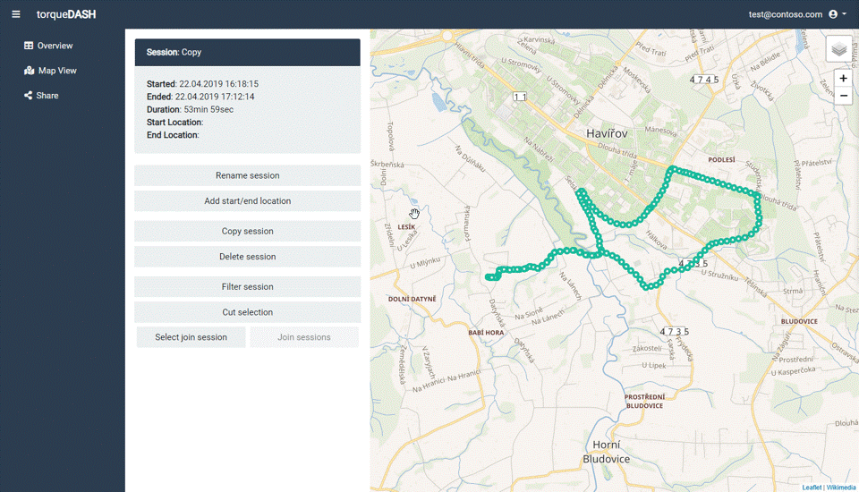
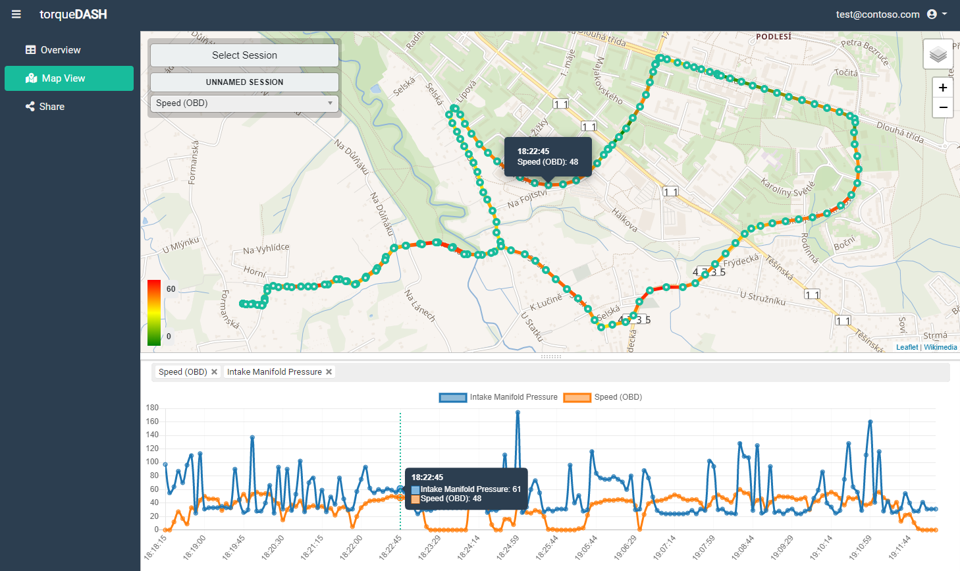
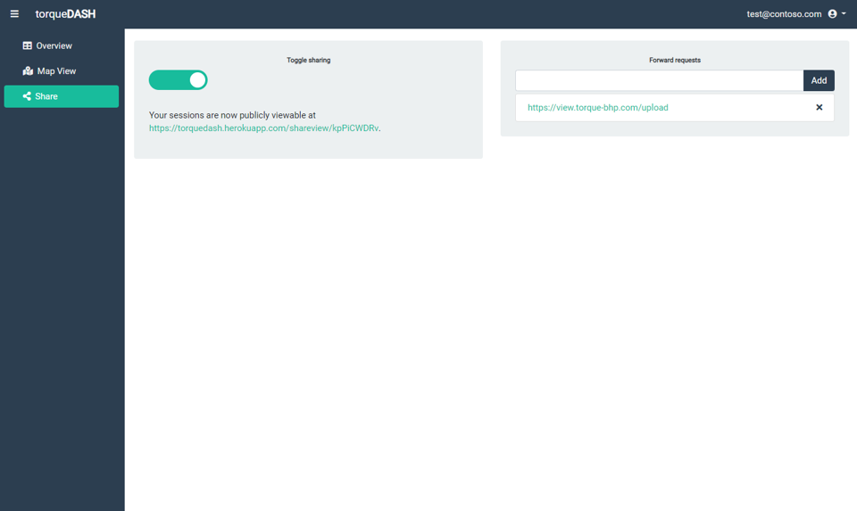

<!-- PROJECT LOGO -->
<br />
<p align="left">
    
  <p align="left">
    A web application for uploading and presenting real-time diagnostic automobile data (OBD2) logged by Torque android app.
  </p>
</p>


<!-- TABLE OF CONTENTS -->
## Table of Contents

* [About the Project](#about-the-project)
  * [Built With](#built-with)
* [Getting Started](#getting-started)
  * [Installation](#installation)
  * [Logging Data](#logging-data)
* [Functionality](#functionality)
* [License](#license)


<!-- ABOUT THE PROJECT -->
## About The Project

This project aims to provide a web application capable of receiving, editing and presenting OBD2 automobile data logged by the [Torque Pro](https://play.google.com/store/apps/details?id=org.prowl.torque&hl=en) android application. This provides an open source alternative to the official Torque Web Viewer.

### Built With
This project was built with the help of

* [Bootstrap](https://getbootstrap.com) - responsive frontend framework
* [JQuery](https://jquery.com) - javascript library used for DOM manipulation and Ajax
* [Node.js](https://nodejs.org) - javascript runtime
* [Express.js](https://expressjs.com) - web framework for Node.js
* [Sequelize.js](http://docs.sequelizejs.com/) - Node.js ORM for relational databases 
* [Leaflet.js](https://leafletjs.com/) - javascript library for interactive maps
* [Chart.js](https://www.chartjs.org/) - javascript charting library
* ...


<!-- GETTING STARTED -->
## Getting Started

To get started using the application you first need a hosting server and postgres database. To try out the app for free, I recommend using a [Heroku Free](https://www.heroku.com/free) Tier account.

### Installation
#### With Heroku

1. Create a fork of the repo.
2. Create a new app in Heroku with a postgres addon
3. Enable GitHub integration for deployment and connect the forked repo to your app ([More info](https://devcenter.heroku.com/articles/github-integration))
4. Deploy the application from heroku.

#### Local

1. Clone the repo
```sh
git clone https://github.com/davekrejci/torque-dash.git
```
2. Install NPM packages
```sh
npm install
```
3. Configure your database connection URI either in your environment variables or in `config.js`
```JS
uri: process.env.DATABASE_URL || 'your connection URI'
```
4. Start the server
```sh
npm start
```

### Logging data

To be able to log data from Torque Pro:

1. Register an account in torqueDASH
2. In Torque Pro settings set the user email address to the same as your accounts.
3. In Torque Pro settings set the Webserver URL to the */api/upload* path
```
https://yourappname.herokuapp.com/api/upload
```

<!-- Functionality -->
## Functionality

### Overview

A filterable table with a list of all logged sessions and options to edit, delete and export session data to CSV.

### Editing

Editing page for sessions with functionality for 

1. renaming
2. adding start/end locations (geocoding option)
3. copying and deleting
4. filtering number of datapoints
5. cutting out parts of the session
6. merging multiple sessions together



### Mapview

Provides a graphical representation of the logged ride on top of a map with a heatline for selected PIDs and a line chart beneath the map for charting PID values. Also displays "live" data if watching a currently ongoing session.



### Share

Provides options for sharing logged data.

1. Sharing with public URL - creates a public URL which provides access to a mapview of your logged sessions
2. Request forwarding - You may list other server URLs to which the data sent from Torque Pro will be further forwarded (eg. official Torque Web Viewer)




<!-- LICENSE -->
## License

Distributed under the MIT License. See `LICENSE` for more information.
